<body>
        
&nbsp;
         <h1 class="p1">1 标准化简介</h1>
为了方便厂商快速开发和接入米家，统一用户在使用米家App、小爱语音控制、小米电视等米系产品中的使用体验，现提供产品在米家App、快捷卡片、温湿度、空气质量等环境信息、设备耗材等部分的接入规范。

标准化项目有如下几项：
<h2>1.1 快捷卡片：</h2>
快捷卡片是一套将产品核心功能提取出来的快捷操作卡片，使得用户在不进入插件，或在带屏音箱、电视等无插件产品的情况下，能够快速控制设备核心功能。

快捷卡片配置的应用场景，包括但不限于：米家App首页宫格快捷操作、快捷操作卡片、MIUI负一屏米家快捷控制、小爱音箱（触屏版）米家快捷控制、小米电视米家快捷控制等。

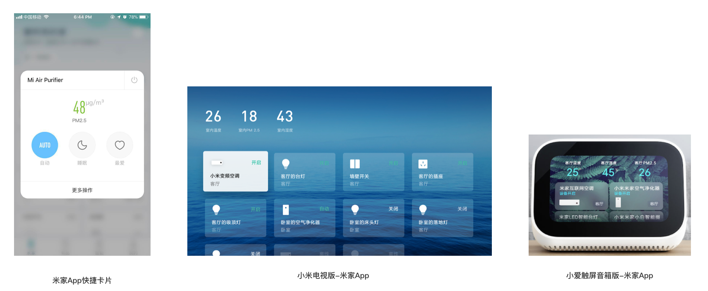
<h2>1.2 家庭环境信息：</h2>
为了统一用户对于家庭环境信息，

应用场景包括但不限于：小爱同学语音、米家App、小爱音箱（触屏版）米家等显示的温度、湿度、空气质量信息

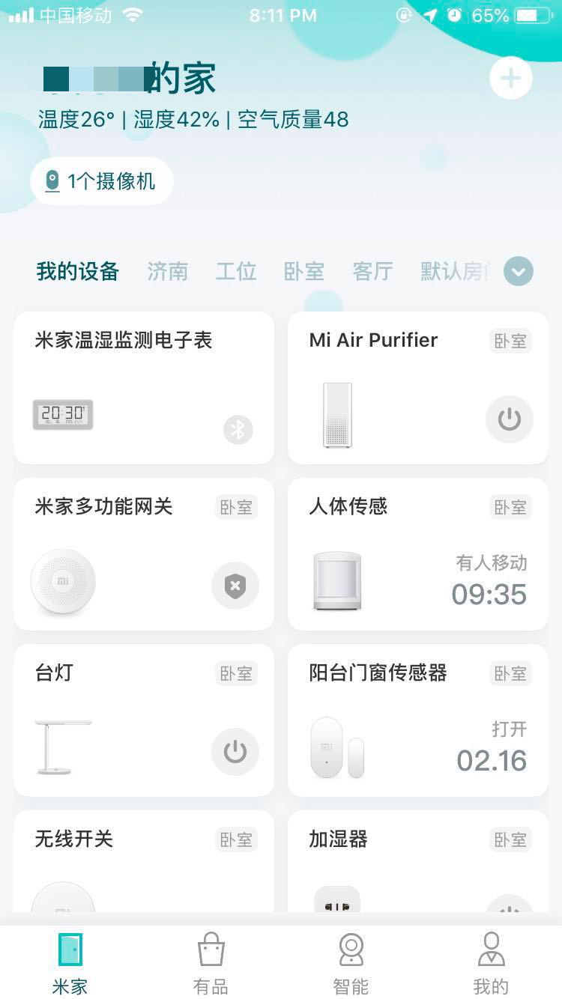
<h2>1.3 设备耗材信息：</h2>
集中显示设备耗材、电量等使用的百分比，方便用户知晓家中设备耗材情况，可直接跳转小米有品打包购买。

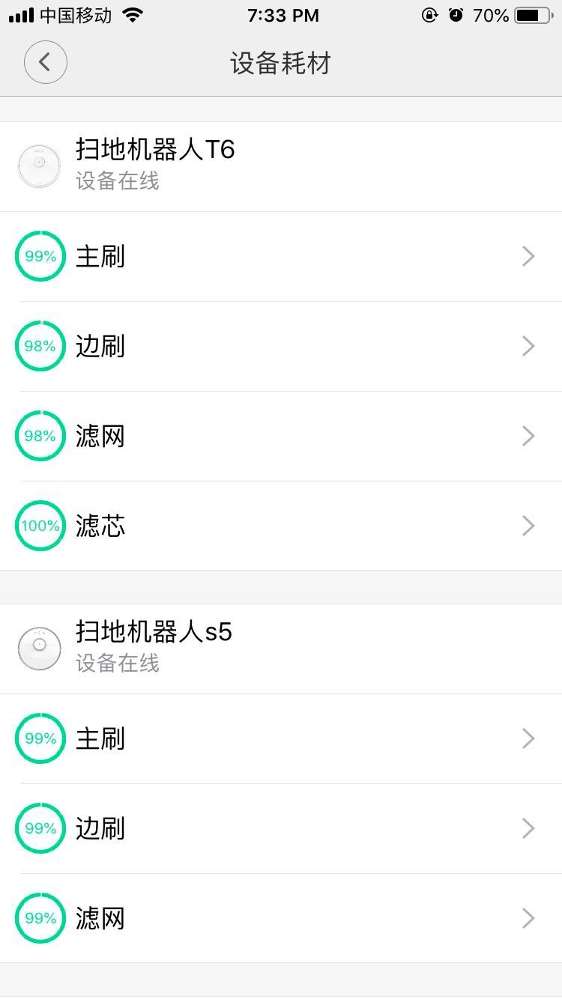

 
<h1>2、接入项目</h1><h2>2.1、米家快捷卡片接入细则</h2>
如果设备支持miot -spec, 则米家会根据spec协议来生成卡片和宫格，无需配置。标准集是spec协议设备需要展示标准卡片样式实现的属性动作集合，原则需要都支持，如果有些属性动作由于硬件限制不能实现，则卡片spec自动适配最小集

如果设备不支持miot-spec，请参考旧版卡片接入指南(<a href="https://iot.mi.com/new/guide.html?file=05-%E7%B1%B3%E5%AE%B6%E6%89%A9%E5%B1%95%E7%A8%8B%E5%BA%8F%E5%BC%80%E5%8F%91%E6%8C%87%E5%8D%97/03-%E7%B1%B3%E5%AE%B6%E5%8D%A1%E7%89%87%E9%85%8D%E7%BD%AE%E8%AF%B4%E6%98%8E/00-%E7%B1%B3%E5%AE%B6%E5%8D%A1%E7%89%87%E9%85%8D%E7%BD%AE%E8%AF%B4%E6%98%8E">profile 卡片配置</a>)，所支持的品类和支持miot-spec的设备对齐并给了示例配置，

下表给出按照品类的快捷卡片规范
<table class="relative-table wrapped confluenceTable" style="width: 100.0%;"><colgroup><col style="width: 2.37649%;"><col style="width: 10.444%;"><col style="width: 9.81864%;"><col style="width: 10.9443%;"><col style="width: 14.0713%;"><col style="width: 15.4472%;"><col style="width: 17.636%;"><col style="width: 11.132%;"><col style="width: 8.13008%;"></colgroup><tbody><tr><th class="confluenceTh"> </th><th class="confluenceTh">品类</th><th class="confluenceTh">细分品类</th><th class="confluenceTh">样式举例（如果设备不支持SPEC，也尽量向spec样式靠齐）</th><th colspan="1" class="confluenceTh">宫格开关样例</th><th colspan="1" class="confluenceTh">耗材</th><th class="confluenceTh">属性或动作的标准集合</th><th colspan="1" class="confluenceTh">spec卡片最小集</th><th colspan="1" style="text-align: center;" class="confluenceTh">旧版卡片配置示例</th></tr><tr><td rowspan="3" class="confluenceTd">1</td><td rowspan="3" class="confluenceTd">灯</td><td class="confluenceTd">仅开关</td><td class="confluenceTd">

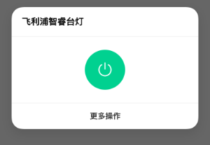

</td><td rowspan="3" class="confluenceTd">

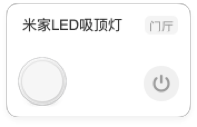

</td><td rowspan="3" class="confluenceTd">无</td><td class="confluenceTd">spec:property:light:on</td><td colspan="1" class="confluenceTd">spec:property:light:on</td><td colspan="1" class="confluenceTd">
<a href="http://cdn.cnbj0.fds.api.mi-img.com//miio.files//commonfile_txt_63ebf8cc371a3e7502a831fca9aecfec.txt">单开关</a>
</td></tr><tr><td class="confluenceTd">开关+亮度</td><td class="confluenceTd">

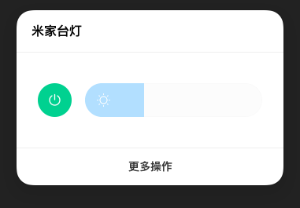

</td><td class="confluenceTd">
spec:property:light:on

spec:property:light:brightness
</td><td colspan="1" class="confluenceTd">spec:property:light:on</td><td colspan="1" class="confluenceTd">
<a href="http://cdn.cnbj0.fds.api.mi-img.com/miio.files/commonfile_txt_8f2e01899b9ab3a4bf24ef1c7f32d76e.txt">开关+亮度</a>
</td></tr><tr><td colspan="1" class="confluenceTd">开关+亮度+色温</td><td colspan="1" class="confluenceTd">

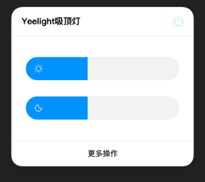

</td><td colspan="1" class="confluenceTd"> </td><td colspan="1" class="confluenceTd">无</td><td colspan="1" class="confluenceTd"><a href="http://cdn.cnbj0.fds.api.mi-img.com/miio.files/commonfile_txt_3fb10323279cd348c1a4d805461b9f0e.txt">开关+亮度+色温</a></td></tr><tr><td class="confluenceTd">

2

</td><td class="confluenceTd">空气净化器</td><td class="confluenceTd"> </td><td class="confluenceTd">

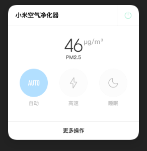

</td><td colspan="1" class="confluenceTd">

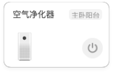

</td><td colspan="1" class="confluenceTd">滤芯状态</td><td class="confluenceTd">
spec:property:air-purifier:on

spec:property:environment:pm2.5-density

spec:property:air-purifier:fan-level
</td><td colspan="1" class="confluenceTd">spec:property:air-purifier:on</td><td colspan="1" class="confluenceTd"><a href="http://cdn.cnbj0.fds.api.mi-img.com/miio.files/commonfile_txt_fd2fbb177e4c928b0723e83e4ff3f898.txt">开关+状态+模式</a></td></tr><tr><td colspan="1" class="confluenceTd">3</td><td colspan="1" class="confluenceTd">扫地机器人</td><td colspan="1" class="confluenceTd"> </td><td colspan="1" class="confluenceTd">

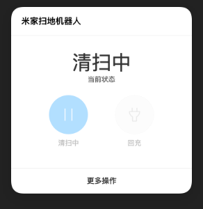

</td><td colspan="1" class="confluenceTd">

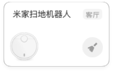

</td><td colspan="1" class="confluenceTd">滤芯状态</td><td colspan="1" class="confluenceTd">
spec:property:vacuum:status

spec:property:vacuum:status

spec:action:vacuum:start-sweep

spec:action:vacuum:stop-sweeping

spec:property:battery:charging-state

spec:action:battery:start-charge
</td><td colspan="1" class="confluenceTd">无</td><td colspan="1" class="confluenceTd"><a href="http://cdn.cnbj0.fds.api.mi-img.com/miio.files/commonfile_txt_7faf1613cf208fee3a054a629c454d86.txt">状态+双开关</a></td></tr><tr><td colspan="1" class="confluenceTd">4</td><td colspan="1" class="confluenceTd">插座</td><td colspan="1" class="confluenceTd">一个开关</td><td colspan="1" class="confluenceTd">

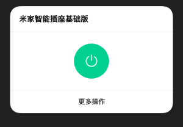

</td><td rowspan="2" class="confluenceTd">

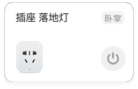

</td><td colspan="1" class="confluenceTd">无</td><td colspan="1" class="confluenceTd">spec:property:switch:on</td><td colspan="1" class="confluenceTd">spec:property:switch:on</td><td colspan="1" class="confluenceTd"><a href="http://cdn.cnbj0.fds.api.mi-img.com//miio.files//commonfile_txt_63ebf8cc371a3e7502a831fca9aecfec.txt">单开关</a></td></tr><tr><td colspan="1" class="confluenceTd"> </td><td colspan="1" class="confluenceTd"> </td><td colspan="1" class="confluenceTd">usb开关+220v开关</td><td colspan="1" class="confluenceTd">

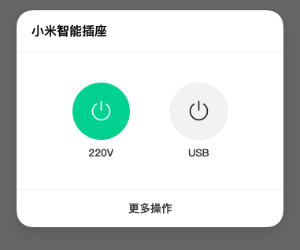

</td><td colspan="1" class="confluenceTd"> </td><td colspan="1" class="confluenceTd">
该品类暂不支持spec，使用传统profile时的建议样式
</td><td colspan="1" class="confluenceTd"> </td><td colspan="1" class="confluenceTd"><a href="http://cdn.cnbj0.fds.api.mi-img.com/miio.files/commonfile_txt_f3095761af7cb8e6b388fa3be8477524.txt">双开关</a></td></tr><tr><td colspan="1" class="confluenceTd">5</td><td colspan="1" class="confluenceTd">插排</td><td colspan="1" class="confluenceTd"> </td><td colspan="1" class="confluenceTd">

</td><td colspan="1" class="confluenceTd">

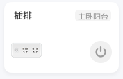

</td><td colspan="1" class="confluenceTd">无</td><td colspan="1" class="confluenceTd">
该品类暂不支持spec，使用传统profile时的建议样式，该品类设备也可能使用插座的spec，这时可以靠齐插座的属性集合

 
</td><td colspan="1" class="confluenceTd"> </td><td colspan="1" class="confluenceTd"><a href="http://cdn.cnbj0.fds.api.mi-img.com//miio.files//commonfile_txt_63ebf8cc371a3e7502a831fca9aecfec.txt">单开关</a></td></tr><tr><td colspan="1" class="confluenceTd">6</td><td colspan="1" class="confluenceTd">空调插座</td><td colspan="1" class="confluenceTd"> </td><td colspan="1" class="confluenceTd">

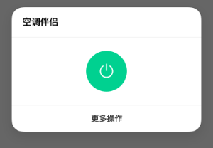

</td><td colspan="1" class="confluenceTd">

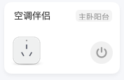

</td><td colspan="1" class="confluenceTd">无</td><td colspan="1" class="confluenceTd">
如设备支持spec，和空调一致，请查阅空调，否则使用建议样式
</td><td colspan="1" class="confluenceTd"> </td><td colspan="1" class="confluenceTd"><a href="http://cdn.cnbj0.fds.api.mi-img.com//miio.files//commonfile_txt_63ebf8cc371a3e7502a831fca9aecfec.txt">单开关</a></td></tr><tr><td colspan="1" class="confluenceTd">7</td><td colspan="1" class="confluenceTd">温湿度传感器</td><td colspan="1" class="confluenceTd"> </td><td colspan="1" class="confluenceTd">

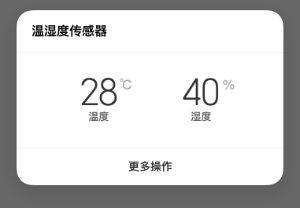

</td><td colspan="1" class="confluenceTd">

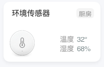

</td><td colspan="1" class="confluenceTd">电池电量</td><td colspan="1" class="confluenceTd">
该品类暂不支持spec，使用传统profile时的建议样式

 
</td><td colspan="1" class="confluenceTd"> </td><td colspan="1" class="confluenceTd"><a href="http://cdn.cnbj0.fds.api.mi-img.com/miio.files/commonfile_txt_3aece3a98534d8a753d78af22fb42d20.txt">温度+湿度</a></td></tr><tr><td colspan="1" class="confluenceTd">8</td><td colspan="1" class="confluenceTd">环境检测仪</td><td colspan="1" class="confluenceTd"> </td><td colspan="1" class="confluenceTd">

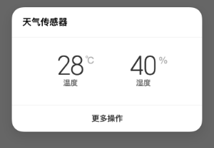

</td><td colspan="1" class="confluenceTd">参考温湿度传感器</td><td colspan="1" class="confluenceTd">电池电量</td><td colspan="1" class="confluenceTd">该品类暂不支持spec，使用传统profile时的建议样式 </td><td colspan="1" class="confluenceTd"> </td><td colspan="1" class="confluenceTd"><a href="http://cdn.cnbj0.fds.api.mi-img.com/miio.files/commonfile_txt_3aece3a98534d8a753d78af22fb42d20.txt">温度+湿度</a></td></tr><tr><td colspan="1" class="confluenceTd">9</td><td colspan="1" class="confluenceTd">空气检测仪</td><td colspan="1" class="confluenceTd"> </td><td colspan="1" class="confluenceTd">

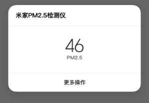

</td><td colspan="1" class="confluenceTd">

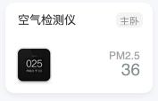

</td><td colspan="1" class="confluenceTd">电池电量</td><td colspan="1" class="confluenceTd">该品类暂不支持spec，使用传统profile时的建议样式 </td><td colspan="1" class="confluenceTd"> </td><td colspan="1" class="confluenceTd"><a href="http://cdn.cnbj0.fds.api.mi-img.com/miio.files/commonfile_txt_7c8af15f0521097d32fa6b2906155d99.txt">状态</a></td></tr><tr><td colspan="1" class="confluenceTd">10</td><td colspan="1" class="confluenceTd">墙壁插座</td><td colspan="1" class="confluenceTd"> </td><td colspan="1" class="confluenceTd">

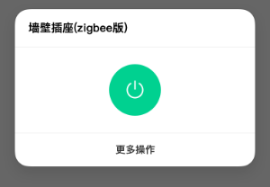

</td><td colspan="1" class="confluenceTd">

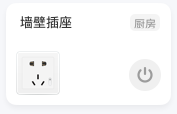

</td><td colspan="1" class="confluenceTd">无</td><td colspan="1" class="confluenceTd">该品类暂不支持spec，使用传统profile时的建议样式 </td><td colspan="1" class="confluenceTd"> </td><td colspan="1" class="confluenceTd"><a href="http://cdn.cnbj0.fds.api.mi-img.com//miio.files//commonfile_txt_63ebf8cc371a3e7502a831fca9aecfec.txt">单开关</a></td></tr><tr><td colspan="1" class="confluenceTd">11</td><td colspan="1" class="confluenceTd">墙壁开关（单键）</td><td colspan="1" class="confluenceTd"> </td><td colspan="1" class="confluenceTd">

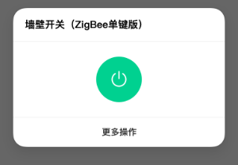

</td><td rowspan="2" class="confluenceTd">

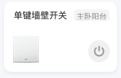

</td><td colspan="1" class="confluenceTd">无</td><td colspan="1" class="confluenceTd">
该品类暂不支持spec，使用传统profile时的建议样式
</td><td colspan="1" class="confluenceTd"> </td><td colspan="1" class="confluenceTd"><a href="http://cdn.cnbj0.fds.api.mi-img.com//miio.files//commonfile_txt_63ebf8cc371a3e7502a831fca9aecfec.txt">单开关</a></td></tr><tr><td colspan="1" class="confluenceTd">12</td><td colspan="1" class="confluenceTd">墙壁开关（双键）</td><td colspan="1" class="confluenceTd"> </td><td colspan="1" class="confluenceTd">

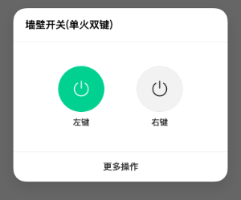

</td><td colspan="1" class="confluenceTd">无</td><td colspan="1" class="confluenceTd">
该品类暂不支持spec，使用传统profile时的建议样式
</td><td colspan="1" class="confluenceTd"> </td><td colspan="1" class="confluenceTd"><a href="http://cdn.cnbj0.fds.api.mi-img.com/miio.files/commonfile_txt_f3095761af7cb8e6b388fa3be8477524.txt">双开关</a></td></tr><tr><td colspan="1" class="confluenceTd">13</td><td colspan="1" class="confluenceTd">窗帘</td><td colspan="1" class="confluenceTd"> </td><td colspan="1" class="confluenceTd">

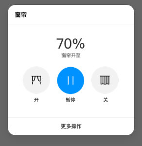

</td><td colspan="1" class="confluenceTd">无</td><td colspan="1" class="confluenceTd">无</td><td colspan="1" class="confluenceTd">
spec:property:curtain:current-position

spec:property:curtain:motor-control
</td><td colspan="1" class="confluenceTd">无</td><td colspan="1" class="confluenceTd"><a href="http://cdn.cnbj0.fds.api.mi-img.com/miio.files/commonfile_txt_fd2fbb177e4c928b0723e83e4ff3f898.txt">开关+状态+模式</a></td></tr><tr><td colspan="1" class="confluenceTd">14</td><td colspan="1" class="confluenceTd">净水器</td><td colspan="1" class="confluenceTd"> </td><td colspan="1" class="confluenceTd">

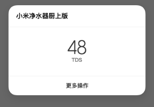

</td><td colspan="1" class="confluenceTd">

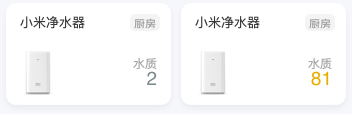

</td><td colspan="1" class="confluenceTd">滤芯状态</td><td colspan="1" class="confluenceTd">spec:property:tds-sensor:tds-out</td><td colspan="1" class="confluenceTd">无</td><td colspan="1" class="confluenceTd"><pre><a href="http://cdn.cnbj0.fds.api.mi-img.com/miio.files/commonfile_txt_b91552d14c9f9fa51ca9884d3b644843.txt">tds</a></pre></td></tr><tr><td class="confluenceTd">15</td><td class="confluenceTd">洗衣机</td><td class="confluenceTd"> </td><td class="confluenceTd">

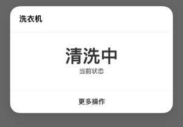

</td><td colspan="1" class="confluenceTd"> </td><td colspan="1" class="confluenceTd">无</td><td class="confluenceTd">
该品类暂不支持spec，使用传统profile时的建议样式 

 
</td><td class="confluenceTd"> </td><td colspan="1" class="confluenceTd"><a href="http://cdn.cnbj0.fds.api.mi-img.com/miio.files/commonfile_txt_7c8af15f0521097d32fa6b2906155d99.txt">状态</a></td></tr><tr><td colspan="1" class="confluenceTd">16</td><td colspan="1" class="confluenceTd">加湿器</td><td colspan="1" class="confluenceTd"> </td><td colspan="1" class="confluenceTd">

</td><td colspan="1" class="confluenceTd">参考墙壁开关</td><td colspan="1" class="confluenceTd">无</td><td colspan="1" class="confluenceTd">spec:property:humidifier:on</td><td colspan="1" class="confluenceTd">无</td><td colspan="1" class="confluenceTd"><a href="http://cdn.cnbj0.fds.api.mi-img.com//miio.files//commonfile_txt_63ebf8cc371a3e7502a831fca9aecfec.txt">单开关</a></td></tr><tr><td colspan="1" class="confluenceTd">17</td><td colspan="1" class="confluenceTd">空调</td><td colspan="1" class="confluenceTd"> </td><td colspan="1" class="confluenceTd">

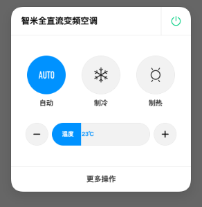

</td><td colspan="1" class="confluenceTd">参考墙壁开关</td><td colspan="1" class="confluenceTd">无</td><td colspan="1" class="confluenceTd">
spec:property:air-conditioner:on

spec:property:air-conditioner:mode

spec:property:air-conditioner:target-temperature
</td><td colspan="1" class="confluenceTd">无</td><td colspan="1" class="confluenceTd"><a href="http://cdn.cnbj0.fds.api.mi-img.com/miio.files/commonfile_txt_898d5a3ad6ea205cc186dc7ef3fb842e.txt">开关+模式+加减</a></td></tr><tr><td rowspan="2" class="confluenceTd">18</td><td rowspan="2" class="confluenceTd">风扇</td><td colspan="1" class="confluenceTd">仅开关</td><td colspan="1" class="confluenceTd">

</td><td rowspan="2" class="confluenceTd">参考墙壁开关  </td><td rowspan="2" class="confluenceTd">无</td><td colspan="1" class="confluenceTd">
spec:property:fan:on

spec:property:fan:horizontal-swing

spec:property:fan:fan-level
</td><td colspan="1" class="confluenceTd">spec:property:fan:on</td><td colspan="1" class="confluenceTd"><a href="http://cdn.cnbj0.fds.api.mi-img.com//miio.files//commonfile_txt_63ebf8cc371a3e7502a831fca9aecfec.txt">单开关</a></td></tr><tr><td colspan="1" class="confluenceTd">开关+转头+档位</td><td colspan="1" class="confluenceTd">

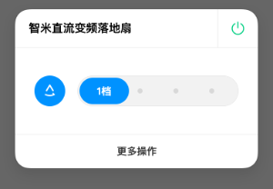

</td><td colspan="1" class="confluenceTd">该品类暂不支持spec，使用传统profile时的建议样式 </td><td colspan="1" class="confluenceTd"> </td><td colspan="1" class="confluenceTd"><a href="http://cdn.cnbj0.fds.api.mi-img.com/miio.files/commonfile_txt_c746dd9974a90420737afa2d19477c6f.txt">开关+转头+档位</a></td></tr><tr><td colspan="1" class="confluenceTd">19</td><td colspan="1" class="confluenceTd">电暖气</td><td colspan="1" class="confluenceTd">仅开关</td><td colspan="1" class="confluenceTd">

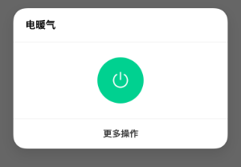

</td><td rowspan="2" class="confluenceTd">

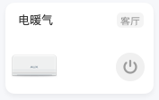

</td><td rowspan="2" class="confluenceTd">无</td><td colspan="1" class="confluenceTd">
该品类暂不支持spec，使用传统profile时的建议样式

 
</td><td colspan="1" class="confluenceTd"> </td><td colspan="1" class="confluenceTd"><a href="http://cdn.cnbj0.fds.api.mi-img.com//miio.files//commonfile_txt_63ebf8cc371a3e7502a831fca9aecfec.txt">单开关</a></td></tr><tr><td colspan="1" class="confluenceTd"> </td><td colspan="1" class="confluenceTd"> </td><td colspan="1" class="confluenceTd">开关+温度调节+室内温度</td><td colspan="1" class="confluenceTd">

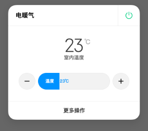

</td><td colspan="1" class="confluenceTd">该品类暂不支持spec，使用传统profile时的建议样式 </td><td colspan="1" class="confluenceTd"> </td><td colspan="1" class="confluenceTd"><pre><a href="http://cdn.cnbj0.fds.api.mi-img.com/miio.files/commonfile_txt_249f7d59b1182f7c02dd0708d4390e1e.txt">开关+状态+加减</a></pre></td></tr><tr><td colspan="1" class="confluenceTd">20</td><td colspan="1" class="confluenceTd">新风机</td><td colspan="1" class="confluenceTd"> </td><td colspan="1" class="confluenceTd">

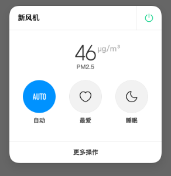

</td><td colspan="1" class="confluenceTd">参考墙壁开关</td><td colspan="1" class="confluenceTd">无</td><td colspan="1" class="confluenceTd">
spec:property:air-fresh:on

spec:property:environment:pm2.5-density

spec:property:air-fresh:fan-level
</td><td colspan="1" class="confluenceTd">spec:property:air-fresh:on</td><td colspan="1" class="confluenceTd"><a href="http://cdn.cnbj0.fds.api.mi-img.com/miio.files/commonfile_txt_fd2fbb177e4c928b0723e83e4ff3f898.txt">开关+状态+模式</a></td></tr><tr><td colspan="1" class="confluenceTd">21</td><td colspan="1" class="confluenceTd">热水器</td><td colspan="1" class="confluenceTd"> </td><td colspan="1" class="confluenceTd">

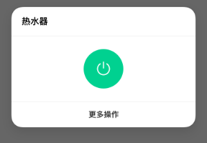

</td><td colspan="1" class="confluenceTd">参考墙壁开关</td><td colspan="1" class="confluenceTd">无</td><td colspan="1" class="confluenceTd">该品类暂不支持spec，使用传统profile时的建议样式 </td><td colspan="1" class="confluenceTd"> </td><td colspan="1" class="confluenceTd"><a href="http://cdn.cnbj0.fds.api.mi-img.com//miio.files//commonfile_txt_63ebf8cc371a3e7502a831fca9aecfec.txt">单开关</a></td></tr><tr><td colspan="1" class="confluenceTd">22</td><td colspan="1" class="confluenceTd">晾衣架</td><td colspan="1" class="confluenceTd"> </td><td colspan="1" class="confluenceTd">

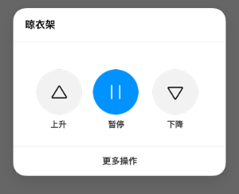

</td><td colspan="1" class="confluenceTd">无</td><td colspan="1" class="confluenceTd">无</td><td colspan="1" class="confluenceTd">该品类暂不支持spec，使用传统profile时的建议样式 </td><td colspan="1" class="confluenceTd"> </td><td colspan="1" class="confluenceTd">目前暂无非 spec 产品</td></tr><tr><td colspan="1" class="confluenceTd">23</td><td colspan="1" class="confluenceTd">摄像头</td><td colspan="1" class="confluenceTd"> </td><td colspan="1" class="confluenceTd">

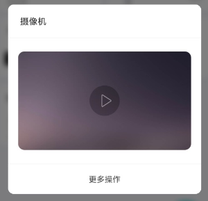

</td><td colspan="1" class="confluenceTd">无洗碗机</td><td colspan="1" class="confluenceTd">无</td><td colspan="1" class="confluenceTd">该品类暂不支持spec，使用传统profile时的建议样式</td><td colspan="1" class="confluenceTd"> </td><td colspan="1" class="confluenceTd"><pre><a href="http://cdn.cnbj0.fds.api.mi-img.com/miio.files/commonfile_txt_719da32ae0835c4d1634c3b4d93e1236.txt">摄像头</a></pre></td></tr><tr><td class="confluenceTd">24</td><td class="confluenceTd">花盆、烟雾(气体、水浸、动静、人体、门窗)传感器、门锁、保险箱</td><td class="confluenceTd"> </td><td class="confluenceTd">无</td><td class="confluenceTd">无</td><td class="confluenceTd">电池电量</td><td class="confluenceTd">无</td><td class="confluenceTd"> </td><td class="confluenceTd">无</td></tr><tr><td colspan="1" class="confluenceTd">25</td><td colspan="1" class="confluenceTd">洗碗机</td><td colspan="1" class="confluenceTd"> </td><td colspan="1" class="confluenceTd">无</td><td colspan="1" class="confluenceTd">无</td><td colspan="1" class="confluenceTd">耗材状态</td><td colspan="1" class="confluenceTd">无</td><td colspan="1" class="confluenceTd"> </td><td colspan="1" class="confluenceTd">无</td></tr></tbody></table><h2>2.2、环境数据数据上报规则</h2><table class="wrapped confluenceTable" style="font-size: 14.0px;letter-spacing: 0.0px;"><colgroup><col><col><col><col><col></colgroup><tbody><tr><th class="confluenceTh"> </th><th class="confluenceTh">profile数据规则</th><th class="confluenceTh">上报规则</th><th class="confluenceTh">是否开机上报</th><th colspan="1" class="confluenceTh">是否支持海外</th></tr><tr><td class="confluenceTd">温度</td><td class="confluenceTd">
显示整数，不要乘100，如：25C
</td><td class="confluenceTd">
1. 温度变化超过2.5度直接上报。

2. 温度变化0.5~2.5度之间，检查上次上报的时间戳，如果超过1分钟则上报，更新时间戳。
</td><td class="confluenceTd">YES</td><td colspan="1" class="confluenceTd">YES</td></tr><tr><td class="confluenceTd">湿度</td><td class="confluenceTd">
显示整数，不要乘100，如：25%
</td><td class="confluenceTd">
1. 湿度变化超过5%直接上报。

2. 湿度变化超过1%~5%之间，检查上次上报的时间戳，如果超过1分钟则上报，更新时间戳。
</td><td class="confluenceTd">YES</td><td colspan="1" class="confluenceTd">YES</td></tr><tr><td class="confluenceTd">PM2.5</td><td class="confluenceTd">
显示整数，如105
</td><td class="confluenceTd">
1. aqi变化超过5直接上报。

2. aqi变化超过1~5之间，检查上次上报的时间戳，如果超过1分钟则上报，更新时间戳。
</td><td class="confluenceTd">YES</td><td colspan="1" class="confluenceTd">YES</td></tr></tbody></table>
 注: 温湿度、pm25属性，如果设备支持miot-spec，需要有miot-spec的定义，需实现相关的service和属性

其他上报时机： 1. 设备开机上报 2. 设备绑定完成后上报 3. 设备断网重连后 ，不用立刻上报，走正常定时上报流程

需支持的环境数据的品类：
<table class="wrapped confluenceTable"><colgroup><col> </colgroup><tbody><tr><th colspan="1" class="confluenceTh">品类</th></tr><tr><td class="confluenceTd">空气净化器</td></tr><tr><td class="confluenceTd">新风机</td></tr><tr><td class="confluenceTd">加湿器</td></tr><tr><td class="confluenceTd">空调</td></tr><tr><td class="confluenceTd">温湿度传感器</td></tr><tr><td class="confluenceTd">空气检测仪</td></tr></tbody></table><h2>2.4、耗材数据上报规则</h2><table class="relative-table wrapped confluenceTable" style="width: 52.1324%;"><colgroup><col style="width: 10.8757%;"><col style="width: 33.6158%;"><col style="width: 33.7571%;"><col style="width: 14.8305%;"><col style="width: 6.9209%;"></colgroup><tbody><tr><th class="confluenceTh">数据规则</th><th class="confluenceTh">profile上报规则</th><th class="confluenceTh">是否开机上报</th><th class="confluenceTh">是否支持海外</th><th colspan="1" class="confluenceTh">可选</th></tr><tr><td class="confluenceTd">耗材消耗百分比</td><td class="confluenceTd">整数，范围1~100,含义是耗材剩余百分比。0%表明完全不可用</td><td class="confluenceTd">
变化超过1%上报，但是如果上次上报时间在30分钟之内不上报。

没有变化，超过6小时上报一次，上报时间按 did % (3600*6) 打散在6小时之内。
</td><td class="confluenceTd">YES</td><td colspan="1" class="confluenceTd">YES</td></tr></tbody></table>
注：有上报的耗材，如果设备支持miot-spec，需要有miot-spec的定义。如果耗材需要用户手动从App点击重置，需要实现spec:action:reset-filter-life。

其他上报时机： 1. 设备开机上报 2. 设备绑定完成后上报 3. 设备断网重连后 ，不用立刻上报，走正常定时上报流程

4. 设备更换耗材、重置耗材后立刻上报一次。&nbsp; &nbsp; &nbsp; &nbsp;

 注：
<ol><li>支持spec耗材的设备品类，要求设备实现filter service，对于蓝牙等设备不支持的话，需要通过蓝牙网关上报耗材信息。</li><li>其他品类带有电池的设备，需要上报电量信息或者低电量提醒，并体现在耗材中心</li></ol>
 

 

        
&nbsp;

</body>