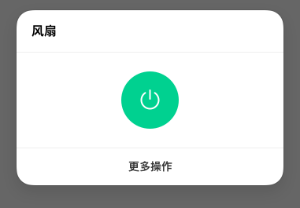

 

### 1 标准化简介 

为了方便厂商快速开发和接入米家，统一用户在使用米家App、小爱语音控制、小米电视等米系产品中的使用体验，现提供产品在米家App、快捷卡片、温湿度、空气质量等环境信息、设备耗材等部分的接入规范。

标准化项目有如下几项：

 

#### 1.1 快捷卡片：
--------------

快捷卡片是一套将产品核心功能提取出来的快捷操作卡片，使得用户在不进入插件，或在带屏音箱、电视等无插件产品的情况下，能够快速控制设备核心功能。

快捷卡片配置的应用场景，包括但不限于：米家App首页宫格快捷操作、快捷操作卡片、MIUI负一屏米家快捷控制、小爱音箱（触屏版）米家快捷控制、小米电视米家快捷控制等。

#### 1.2 家庭环境信息：
------------------

为了统一用户对于家庭环境信息，

应用场景包括但不限于：小爱同学语音、米家App、小爱音箱（触屏版）米家等显示的温度、湿度、空气质量信息

### 2、接入项目

#### 2.1、米家快捷卡片接入细则
-------------------------

如果设备支持miot -spec,
则米家会根据spec协议来生成卡片，无需配置。标准集是spec协议设备需要展示标准卡片样式实现的属性动作集合，原则需要都支持，如果有些属性动作由于硬件限制不能实现，则卡片spec自动适配最小集

如果设备不支持miot-spec，请参考旧版卡片接入指南，自行配置，所支持的品类和支持miot-spec的设备对齐

下表给出按照品类的快捷卡片规范

||品类|细分品类|样式举例（如果设备不支持SPEC，也尽量向spec样式靠齐）|属性或动作的标准集合|spec卡片最小集|profile 配置示例|
|---|---|---|---|---|---|---|
|1|灯|仅开关||spec:property:light:on | spec:property:light:on|请参考 4 插座-一个开关
|||开关+亮度||spec:property:light:on spec:property:light:brightness|spec:property:light:on|[http://cdn.cnbj0.fds.api.mi-img.com/miio.files/commonfile\_txt\_6a5e898ef5beef9e5c99ee35c91166c1.txt](http://cdn.cnbj0.fds.api.mi-img.com/miio.files/commonfile_txt_6a5e898ef5beef9e5c99ee35c91166c1.txt)
|||开关+亮度+色温||无|无|[http://cdn.cnbj0.fds.api.mi-img.com/miio.files/commonfile\_txt\_08c3b7324d6282c1ec3e825dc002a330.txt](http://cdn.cnbj0.fds.api.mi-img.com/miio.files/commonfile_txt_08c3b7324d6282c1ec3e825dc002a330.txt)
|2|空气净化器|||spec:property:air-purifier:on spec:property:environment:pm2.5-density spec:property:air-purifier:fan-level | spec:property:air-purifier:on|[http://cdn.cnbj0.fds.api.mi-img.com/miio.files/commonfile\_txt\_d2a71d83331cead3e748d5a1bf39a508.txt](http://cdn.cnbj0.fds.api.mi-img.com/miio.files/commonfile_txt_d2a71d83331cead3e748d5a1bf39a508.txt)|
|3|扫地机器人|||spec:property:vacuum:status spec:property:vacuum:status spec:action:vacuum:start-sweep spec:action:vacuum:stop-sweeping spec:property:battery:charging-state|spec:action:battery:start-charge|无|[http://cdn.cnbj0.fds.api.mi-img.com/miio.files/commonfile\_txt\_cffaabcfb447531447574009fc36d14c.txt](http://cdn.cnbj0.fds.api.mi-img.com/miio.files/commonfile_txt_cffaabcfb447531447574009fc36d14c.txt)
|4|插座|一个开关||spec:property:switch:on | spec:property:switch:on |[http://cdn.cnbj0.fds.api.mi-img.com/miio.files/commonfile\_txt\_0a8816c13c19d4e673f3fcefa0596cee.txt](http://cdn.cnbj0.fds.api.mi-img.com/miio.files/commonfile_txt_0a8816c13c19d4e673f3fcefa0596cee.txt)|
|||usb开关+220v开关||该品类暂不支持spec，使用传统profile时的建议样式||[http://cdn.cnbj0.fds.api.mi-img.com/miio.files/commonfile\_txt\_146f79704e95eeafcfbb38d320d51d23.txt](http://cdn.cnbj0.fds.api.mi-img.com/miio.files/commonfile_txt_146f79704e95eeafcfbb38d320d51d23.txt)|
|5|插排|||该品类暂不支持spec，使用传统profile时的建议样式，该品类设备也可能使用插座的spec，这时可以靠齐插座的属性集合||[http://cdn.cnbj0.fds.api.mi-img.com/miio.files/commonfile\_txt\_0a8816c13c19d4e673f3fcefa0596cee.txt](http://cdn.cnbj0.fds.api.mi-img.com/miio.files/commonfile_txt_0a8816c13c19d4e673f3fcefa0596cee.txt)|
|6|空调插座|||如设备支持spec，和空调一致，请查阅空调，否则使用建议样式 | | [http://cdn.cnbj0.fds.api.mi-img.com/miio.files/commonfile\_txt\_0a8816c13c19d4e673f3fcefa0596cee.txt](http://cdn.cnbj0.fds.api.mi-img.com/miio.files/commonfile_txt_0a8816c13c19d4e673f3fcefa0596cee.txt)|
|7|网关|电台+夜灯+警戒||该品类暂不支持spec，使用传统profile时的建议样式||[http://cdn.cnbj0.fds.api.mi-img.com/miio.files/commonfile_txt_cef9df003e6f60260cdfab2a1f115308.txt](http://cdn.cnbj0.fds.api.mi-img.com/miio.files/commonfile_txt_cef9df003e6f60260cdfab2a1f115308.txt)|
|||夜灯+警戒||该品类暂不支持spec，使用传统profile时的建议样式||[http://cdn.cnbj0.fds.api.mi-img.com/miio.files/commonfile\_txt\_70d2c3e379003c250eb2bc1519c18908.txt](http://cdn.cnbj0.fds.api.mi-img.com/miio.files/commonfile_txt_70d2c3e379003c250eb2bc1519c18908.txt)|
|||警戒||该品类暂不支持spec，使用传统profile时的建议样式||请参考 4 插座-一个开关|
|8|温湿度传感器|||该品类暂不支持spec，使用传统profile时的建议样式||[http://cdn.cnbj0.fds.api.mi-img.com/miio.files/commonfile\_txt\_7742eb5d66c11feeae87dd8c80ba129a.txt](http://cdn.cnbj0.fds.api.mi-img.com/miio.files/commonfile_txt_7742eb5d66c11feeae87dd8c80ba129a.txt)|
|9|环境检测仪|||该品类暂不支持spec，使用传统profile时的建议样式||[http://cdn.cnbj0.fds.api.mi-img.com/miio.files/commonfile\_txt\_7742eb5d66c11feeae87dd8c80ba129a.txt](http://cdn.cnbj0.fds.api.mi-img.com/miio.files/commonfile_txt_7742eb5d66c11feeae87dd8c80ba129a.txt)|
|10|空气检测仪|||该品类暂不支持spec，使用传统profile时的建议样式||[http://cdn.cnbj0.fds.api.mi-img.com/miio.files/commonfile_txt_6deaf67362964ae4ee9cdc8b0e461df4.txt](http://cdn.cnbj0.fds.api.mi-img.com/miio.files/commonfile_txt_6deaf67362964ae4ee9cdc8b0e461df4.txt)|
|11|动静传感器|||该品类暂不支持spec，使用传统profile时的建议样式|||
|12|墙壁插座|||该品类暂不支持spec，使用传统profile时的建议样式||[http://cdn.cnbj0.fds.api.mi-img.com/miio.files/commonfile\_txt\_0a8816c13c19d4e673f3fcefa0596cee.txt](http://cdn.cnbj0.fds.api.mi-img.com/miio.files/commonfile_txt_0a8816c13c19d4e673f3fcefa0596cee.txt)|
|13|墙壁开关（单键）|||该品类暂不支持spec，使用传统profile时的建议样式||[http://cdn.cnbj0.fds.api.mi-img.com/miio.files/commonfile\_txt\_0a8816c13c19d4e673f3fcefa0596cee.txt](http://cdn.cnbj0.fds.api.mi-img.com/miio.files/commonfile_txt_0a8816c13c19d4e673f3fcefa0596cee.txt)|
|14|墙壁开关（双键）|||该品类暂不支持spec，使用传统profile时的建议样式||[http://cdn.cnbj0.fds.api.mi-img.com/miio.files/commonfile\_txt\_146f79704e95eeafcfbb38d320d51d23.txt](http://cdn.cnbj0.fds.api.mi-img.com/miio.files/commonfile_txt_146f79704e95eeafcfbb38d320d51d23.txt)|
|15|窗帘|||spec:property:curtain:current-position spec:property:curtain:motor-control|无|请参考 2 空气净化器|
|16|净水器|||spec:property:tds-sensor:tds-out| 无 | [http://cdn.cnbj0.fds.api.mi-img.com/miio.files/commonfile\_txt\_6deaf67362964ae4ee9cdc8b0e461df4.txt](http://cdn.cnbj0.fds.api.mi-img.com/miio.files/commonfile_txt_6deaf67362964ae4ee9cdc8b0e461df4.txt)|
|17|洗衣机|||该品类暂不支持spec，使用传统profile时的建议样式||[http://cdn.cnbj0.fds.api.mi-img.com/miio.files/commonfile\_txt\_4588a9e293d4cf90a8e3f88c03bc192a.txt](http://cdn.cnbj0.fds.api.mi-img.com/miio.files/commonfile_txt_4588a9e293d4cf90a8e3f88c03bc192a.txt)|
|18|加湿器|||spec:property:humidifier:on|无|[http://cdn.cnbj0.fds.api.mi-img.com/miio.files/commonfile\_txt\_0a8816c13c19d4e673f3fcefa0596cee.txt](http://cdn.cnbj0.fds.api.mi-img.com/miio.files/commonfile_txt_0a8816c13c19d4e673f3fcefa0596cee.txt)|
|19||空调||spec:property:air-conditioner:on spec:property:air-conditioner:mode spec:property:air-conditioner:target-temperature|无|[http://cdn.cnbj0.fds.api.mi-img.com/miio.files/commonfile\_txt\_61db11ae1252260e36a27976d3d56b81.txt](http://cdn.cnbj0.fds.api.mi-img.com/miio.files/commonfile_txt_61db11ae1252260e36a27976d3d56b81.txt)|
|20|风扇|仅开关||spec:property:fan:on spec:property:fan:horizontal-swing spec:property:fan:fan-level | spec:property:fan:on|[http://cdn.cnbj0.fds.api.mi-img.com/miio.files/commonfile\_txt\_0a8816c13c19d4e673f3fcefa0596cee.txt](http://cdn.cnbj0.fds.api.mi-img.com/miio.files/commonfile_txt_0a8816c13c19d4e673f3fcefa0596cee.txt)|
|||开关+转头+档位||该品类暂不支持spec，使用传统profile时的建议样式||[http://cdn.cnbj0.fds.api.mi-img.com/miio.files/commonfile\_txt\_eec0b6ec739b0b89e409ac4683748740.txt](http://cdn.cnbj0.fds.api.mi-img.com/miio.files/commonfile_txt_eec0b6ec739b0b89e409ac4683748740.txt)|
|21|电暖气|仅开关||该品类暂不支持spec，使用传统profile时的建议样式||[http://cdn.cnbj0.fds.api.mi-img.com/miio.files/commonfile\_txt\_0a8816c13c19d4e673f3fcefa0596cee.tx](http://cdn.cnbj0.fds.api.mi-img.com/miio.files/commonfile_txt_0a8816c13c19d4e673f3fcefa0596cee.txt)[t](http://cdn.cnbj0.fds.api.mi-img.com/miio.files/commonfile_txt_ccf22d1ea3617d5d930c42949c47c37a.txt)|
|||开关+温度调节+室内温度||该品类暂不支持spec，使用传统profile时的建议样式||[http://cdn.cnbj0.fds.api.mi-img.com/miio.files/commonfile\_txt\_ccf22d1ea3617d5d930c42949c47c37a.txt](http://cdn.cnbj0.fds.api.mi-img.com/miio.files/commonfile_txt_ccf22d1ea3617d5d930c42949c47c37a.txt)|
|22|新风机|||spec:property:air-fresh:on spec:property:environment:pm2.5-density spec:property:air-fresh:fan-level | spec:property:air-fresh:on|[http://cdn.cnbj0.fds.api.mi-img.com/miio.files/commonfile\_txt\_d2a71d83331cead3e748d5a1bf39a508.txt](http://cdn.cnbj0.fds.api.mi-img.com/miio.files/commonfile_txt_d2a71d83331cead3e748d5a1bf39a508.txt)|
|23|热水器|||该品类暂不支持spec，使用传统profile时的建议样式||[http://cdn.cnbj0.fds.api.mi-img.com/miio.files/commonfile\_txt\_0a8816c13c19d4e673f3fcefa0596cee.tx](http://cdn.cnbj0.fds.api.mi-img.com/miio.files/commonfile_txt_0a8816c13c19d4e673f3fcefa0596cee.txt)[t](http://cdn.cnbj0.fds.api.mi-img.com/miio.files/commonfile_txt_ccf22d1ea3617d5d930c42949c47c37a.txt)|
|24|晾衣架|||该品类暂不支持spec，使用传统profile时的建议样式||||
|25|摄像头| |  | | | [http://cdn.cnbj0.fds.api.mi-img.com/miio.files/commonfile\_txt\_16a41b58974bbab6b79a5fb15859b13c.txt](http://cdn.cnbj0.fds.api.mi-img.com/miio.files/commonfile_txt_16a41b58974bbab6b79a5fb15859b13c.txt)|

#### 2.2、米家首页宫格开关及状态信息展示
-----------------------------------

如果设备支持miot -spec,
则米家会根据spec协议来生成宫格开关及状态信息展示，无需配置。

如果设备不支持miot-spec，请参考旧版宫格开关及状态信息展示接入指南，自行配置，所支持的品类和支持miot-spec的设备对齐

下表给出按照品类的宫格开关及状态信息展示规范

| 品类 | 首页宫格开关及状态信息展示 | 操作信息 | 具体信息 | 相关属性或动作 | 样式 |
|---|---|---|---|---|---|
|1|灯|操作|开关|spec:property:light:on||
|2|空气净化器|操作|开关|spec:property:air-purifier:on||
|3|扫地机器人|操作|清扫/暂停|spec:action:vaccum:start-sweep spec:action:vaccum:stop-sweep|
|4|插座|操作|开关|spec:property:switch:on||
|5|插排|操作|开关|该品类暂不支持spec，使用传统profile时的建议样式，该品类设备也可能使用插座的spec，这时可以靠齐插座的属性集合||
|6|空调插座|操作|开关|如设备支持spec，和空调一致，请查阅空调，否则使用建议样式||
|7|网关|操作|警戒|该品类暂不支持spec，使用传统profile时的建议样式||
|8|温湿度传感器|信息|温度、湿度|该品类暂不支持spec，使用传统profile时的建议样式||
|9|空气检测仪|信息|PM2.5|该品类暂不支持spec，使用传统profile时的建议样式||
|10|加湿器|操作|开关|spec:property:humidifier:on||
|11|动静传感器|信息|震动+时间|该品类暂不支持spec，使用传统profile时的建议样式||
|12|墙壁插座|操作|开关|该品类暂不支持spec，使用传统profile时的建议样式||
|13|墙壁开关（单键）|操作|开关|该品类暂不支持spec，使用传统profile时的建议样式||
|14|洗衣机|信息|状态|该品类暂不支持spec，使用传统profile时的建议样式||
|15|空气检测仪|信息|PM2.5|spec:property:environment:pm2.5-density||
|16|净水器|信息| TDS | spec:property:tds-sensor:tds-out||
|17|空调|操作|开关|spec:property:air-conditioner:on||
|18|风扇|操作|开关|spec:property:fan:on||
|19|电暖气|操作|开关|该品类暂不支持spec，使用传统profile时的建议样式|
|20|新风机|操作|开关|spec:property:air-fresh:on|
